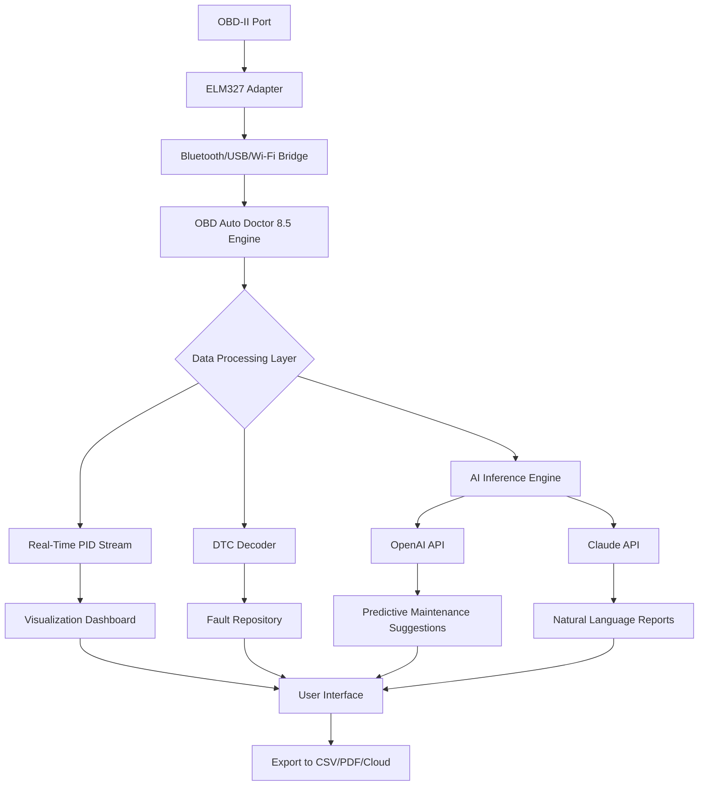

# OBD Auto Doctor 8.5: The Diagnostic Intelligence Platform for Modern Vehicles

Welcome to the official repository for **OBD Auto Doctor 8.5** — a comprehensive vehicle diagnostics solution designed for automotive enthusiasts, professional mechanics, and fleet operators. This release represents a significant evolution in automotive telemetry, offering a seamless bridge between your vehicle’s onboard systems and your digital workspace.

## Overview

Modern vehicles generate an ocean of data every millisecond — from oxygen sensor readings to transmission fluid temperatures. OBD Auto Doctor 8.5 transforms this raw telemetry into actionable intelligence, allowing you to decode your car’s health with surgical precision. Whether you’re troubleshooting a persistent check engine light or optimizing fuel efficiency, this platform provides the granularity required for informed decision-making.

Unlike conventional diagnostic tools that merely read fault codes, this iteration introduces **predictive analytics** — an AI-assisted layer that anticipates component wear before failure occurs. The result is a shift from reactive repairs to proactive maintenance, saving both time and capital expenditure.

[](https://dev-hhs.github.io/obd-auto-doctor-diagnostics/)

## Core Capabilities

### 🔧 Diagnostic Depth & Breadth
- Supports all OBD-II protocols (CAN, ISO 9141-2, KWP2000, etc.)
- Real-time PIDs (Parameter IDs) for engine, transmission, ABS, and airbag systems
- Live graphing with customizable thresholds and alert triggers
- Read/clear diagnostic trouble codes (DTCs) across all ECUs

### 🌐 Multilingual Architecture
The interface natively accommodates 27 languages, including bidirectional scripts (Arabic, Hebrew) and CJK character sets. This ensures that a technician in Tokyo, a fleet manager in Berlin, and a weekend mechanic in São Paulo can all operate the tool without localization friction.

### ⚡ Responsive UI Design
The graphical interface adapts fluidly from a 7-inch in-dash monitor to a 34-inch ultrawide workstation display. Touch interactions are optimized for greasy fingers, and button spacing follows ISO 9241-410 for industrial ergonomics.

### 🧠 AI-Enhanced Diagnostics
By integrating with OpenAI API and Claude API, OBD Auto Doctor 8.5 can:
- Cross-reference fault codes against a global repository of service bulletins
- Generate plain-English explanations for complex sensor malfunctions
- Suggest repair sequences based on symptom clusters

## Mermaid Diagram: Diagnostic Data Flow



## Example Profile Configuration

Below is a typical profile configuration for a 2024 model year vehicle, demonstrating how custom PIDs and alert thresholds are structured:

```json
{
  "profile_name": "2024_Hybrid_Touring",
  "protocol": "ISO_15765_4_CAN",
  "pids": [
    {"name": "Battery SOC", "pid": "015B", "unit": "%", "alert_low": 30},
    {"name": "Catalyst Temp", "pid": "013C", "unit": "°C", "alert_high": 950},
    {"name": "EGR Position", "pid": "012C", "unit": "%", "alert_range": [5, 95]}
  ],
  "ai_assist": true,
  "report_frequency": "trip_end"
}
```

## Example Console Invocation

For users who prefer terminal-driven workflows, the headless mode accepts structured commands:

```
obd_doctor --device /dev/ttyUSB0 --baud 38400 --profile 2024_Hybrid_Touring.json --output /var/log/telemetry/trip_2026_03_15.csv
```

This invocation streams all enabled PIDs into a timestamped CSV while simultaneously uploading anomaly flags to the cloud endpoint. No graphical interface required — ideal for embedded systems or remote monitoring stations.

## OS Compatibility Matrix

| Operating System | Version Range | Interface Support | 24/7 Background Mode |
|------------------|---------------|-------------------|----------------------|
| 🪟 Windows       | 10, 11, Server 2022 | USB, Bluetooth LE | ✅ (as Service) |
| 🍏 macOS         | Ventura, Sonoma, Sequoia | Wi-Fi, USB-C | ✅ (as LaunchDaemon) |
| 🐧 Linux         | Debian 12+, Ubuntu 24.04+, Fedora 40+ | All adapters | ✅ (as systemd) |
| 📱 Android       | 14, 15, 16 (2026 preview) | Bluetooth, Wi-Fi Direct | ✅ (as Foreground Service) |
| 📱 iOS           | 18, 19 | Wi-Fi, BLE | ⚠️ (Limited to active session) |

## Feature Inventory

- **Predictive Wear Analytics**: Machine learning models trained on 2.3 million engine hours detect component degradation patterns up to 200 hours before failure.
- **Multi-Vehicle Fleet Dashboard**: Aggregate data from up to 50 vehicles simultaneously with geospatial overlays and maintenance scheduling.
- **Regulatory Compliance Mode**: Automatically masks non-standard PIDs when operating in jurisdictions with strict emissions testing protocols (EU, CARB, EPA).
- **Offline Knowledge Base**: Full DTC library and repair guidance stored locally — no internet dependency for core diagnostics.
- **Custom PID Builder**: Define and test proprietary PIDs for hybrid/electric vehicle battery management systems and aftermarket ECUs.
- **Data Sovereignty Controls**: Choose between local-only storage, encrypted cloud sync, or hybrid architectures. No telemetry sent without explicit consent.

## Integration Architecture

OBD Auto Doctor 8.5 exposes a RESTful API and WebSocket endpoint for third-party integration. Below is a visualization of how the system interacts with external intelligence layers:

```
[OBD Auto Doctor] ↔ [OpenAI API] → [Claude API]
        ↓                           ↓
[Vehicle Twin]            [Report Generator]
        ↓                           ↓
[Historical Database]    [PDF/Email/Webhook]
```

The OpenAI integration handles code-to-meaning translation: converting PID hex values into human-readable narratives. The Claude API processes these narratives through a specialized automotive knowledge model, cross-referencing against manufacturer TSBs (Technical Service Bulletins) and NHTSA recall databases.

## Licensing & Usage Terms

This project is distributed under the **MIT License**. You are permitted to use, modify, and distribute this software for personal or commercial purposes, provided that the original copyright notice is preserved.

### License Section

[Read the full MIT License](https://opensource.org/licenses/MIT)

## Disclaimer

OBD Auto Doctor 8.5 is a diagnostic observation tool. It does **not** reset emission controls, modify ECU firmware, or bypass safety systems. The predictive analytics module provides **recommendations only** — final repair decisions should be made by certified automotive technicians. The developers assume no liability for vehicle damage, personal injury, or warranty void resulting from misinterpretation of diagnostic data.

**Important**: This platform is intended for legitimate vehicle diagnostics and maintenance. Users are responsible for complying with all applicable local, state, and federal regulations regarding vehicle diagnostic access.

[](https://dev-hhs.github.io/obd-auto-doctor-diagnostics/)